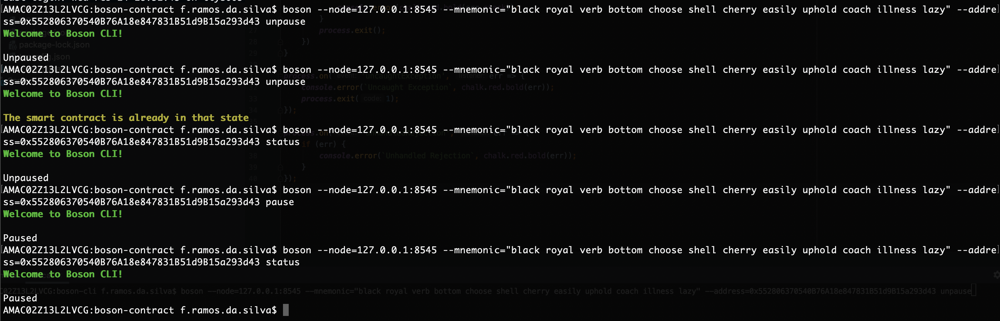

# Boson Protocol Challenge - Felipe Ramos

## Introduction

### Goal 

It was requested to create a smart contract with the solidity file that were provided, 
deployed that file to a local test node, and then create a simply CLI that can have the capability 
to interact with the deployed smart contract.

### Used Tools

- Truffle, Ganache-cli
- Solidity
- NodeJS 
- Typescript
- Web3
- Minimist


## How Is that Challenge Solution Compounded ?

This solution is based in two folders:
- boson-cli: This is the project where the Node(Typescript) CLI remains.
- boson-contract: The Truffle project with the provided solidity file, to deploy the smartcontract on Ganache.

## Justification for Selection The Used Tools

- Truffle/Ganache: Helps us fast deploying smartcontracts on local node, with Ganache, you are able to 
have 10 acccounts, 10 private keys, one mnemonic. The project also deploys a migrations contract, with helps us to interact 
with the deployed contracts.
- Typescript: Most of the ERC20 apps are now being written in typescript, using web3 as a RPC for sending transactions to the node.
- Minimist: It's an argument parsing npm package, that helps in parsing arguments in a effective way.
- Solidity: The programming language for deploying smartcontracts.

## How to Run This Solution

### STEP 1 - Deploy Smart Contract

First of all, you need to run a ganache-cli node on your computer, for this, execute the following commands:
```
npm install -g ganache-cli
ganache-cli
```

After that you would be able to get the generated wallet addresses, private keys and mnemonic, take note of this mnemonic
because you will need this to sign the written transactions with web3, without this you wouldn't be possible to submit transactions,
because the method pause and unpause in the smartcontract, is onlyOwner.

Now let's install truffle to deploy the smartcontracts:
```
npm install -g truffle
```

After that you need to navigate to boson-contract folder, and run the truffle compile command to
compile the solidity files:
```
truffle compile
```

Finally we can deploy it to ganache local node, with the command:
```
truffle migrate --network development
```

Two smartcontracts will be deployed, the BosonProtocol and Migrations, inside the folder boson-contract, a new folder 
called build will be created, with the contracts in json format. Remember about the [/boson-contract/build/contracts/BosonProtocol.json]()
file, because we will need this one for the Node CLI.

Additionally, if you want to use truffle to interact with the smartcontract, you can do those commands:
```
truffle console
let bosonInstance = await BosonProtocol.deployed()
bosonInstance.paused()
```

### STEP 2 - Building and Running the CLI

As this CLI uses web3 RPC to interact with the smartcontract, you will need to get the ABI, from the
deployed smartcontract, because web3 uses that ABI as an argument, to be able to connect with the smartcontract and
send transactions.

So, take the file [/boson-contract/build/contracts/BosonProtocol.json]() and place on [/boson-cli/src/abi/](),
then you are ready to install the CLI, build and run that.

First, inside boson-cli folder, install the dependencies with:
```
npm install
```
Then, build the application:
```
npm run build
```

After that you will be able to execute the link command:
```
npm link
```

The npm link will create symbolic links for your built application, and you would be able to run this
as a cli. After that you just need to run the cli with the arguments:

- --node: The ethereum node 
- --mnemonic: The mnemonic that ganache provided to you, it has to be enclousured by double quotes.
- --address: The smartcontract address
- --method: The method that will be executed, it can be status, pause or unpause.

An example of running this would be:
```
boson --node=127.0.0.1:8545 --mnemonic="black royal verb bottom choose shell cherry easily uphold coach illness lazy" --address=0x552806370540B76A18e847831B51d9B15a293d43 unpause
```

Here is the result of the execution:

